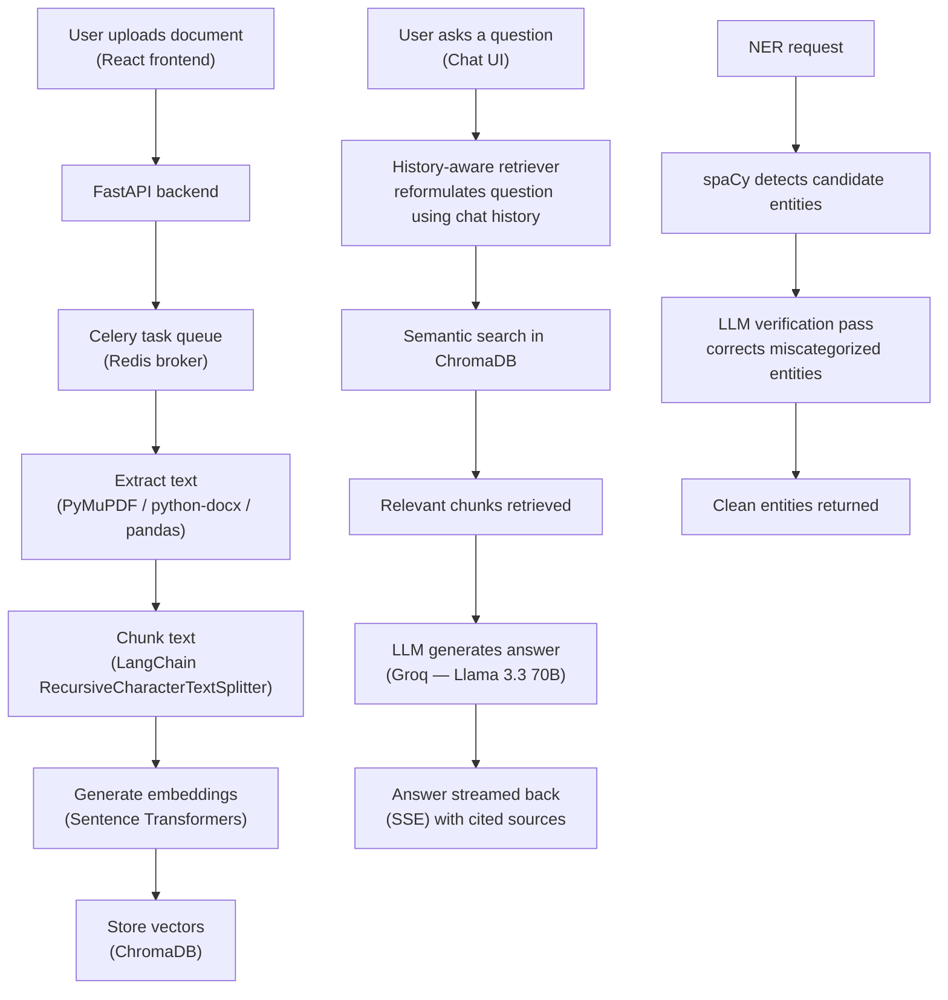

# AI Document Intelligence & RAG Chat Assistant

**An enterprise-style document AI platform** — upload a PDF, DOCX, TXT, or CSV file and get a full AI toolkit around it: chat with the document using RAG, summarize it, generate questions, analyze sentiment, extract entities, translate it, or compare it against another document.

Most "chat with your PDF" demos stop at a single Q&A loop. This project goes further — it's built with production concerns in mind: async background processing, caching, rate limiting, structured logging, role-based access, and a full analytics dashboard tracking how the AI pipeline itself is performing (response times, token usage, model breakdown).

---

## Architecture



The document pipeline (upload → extract → chunk → embed → store) runs entirely in the background via Celery, so the API stays responsive even while a large document is being processed. The chat pipeline is retrieval-augmented — the LLM never answers from memory alone; it always grounds its response in chunks actually retrieved from the document.

---

## The Problem This Solves

Most document-QA tools either (a) dump the whole document into a single LLM prompt — which breaks on anything longer than a few pages and gets expensive fast — or (b) do naive keyword search, which misses anything phrased differently than the source text.

| | Naive "paste whole doc" tools | Keyword search tools | This project |
|---|---|---|---|
| Handles long documents | ❌ breaks on context limits | ✅ | ✅ (chunked + retrieved) |
| Understands meaning, not just keywords | ✅ | ❌ | ✅ (semantic embeddings) |
| Cites sources for its answers | ❌ | ✅ | ✅ |
| Remembers conversation context | ❌ | N/A | ✅ (history-aware retriever) |
| NER stays accurate on messy/unstructured docs | N/A | N/A | ✅ (hybrid spaCy + LLM verification) |

---

## Features

- **RAG Chat** — context-aware, source-cited answers with streaming (SSE) responses and conversation memory
- **Summarization** — short / detailed / bullet-point / key-takeaway summaries, auto-switching between single-pass and map-reduce for long documents
- **Question Generation** — FAQ, interview, and quiz-style questions from document content
- **Sentiment Analysis** — overall + per-sentence sentiment with confidence scores (HuggingFace transformer)
- **Named Entity Recognition** — hybrid spaCy detection + LLM verification pass for persons, organizations, locations, dates, emails, and phone numbers
- **Semantic Search** — vector similarity search over document content
- **Translation** — full-document translation (chunked for long docs) into 10 languages, preserving structure, with a coverage percentage if any section fails
- **Document Comparison** — AI-generated similarities/differences summary between two documents
- **PDF Export** — download all AI analysis results for a document as a formatted PDF report
- **Document Management** — upload, rename, categorize, delete, paginate, and filter (by type/status/date)
- **Auth & Roles** — JWT access tokens + refresh token rotation, role-based access control, admin panel (promote/demote, activate/deactivate, delete users — with self-demotion/self-deletion protection)
- **Analytics Dashboard** — document/conversation stats, AI performance by feature and model, response time distribution histogram, file type breakdown (Recharts)

---

## Tech Stack

**Backend**
- **FastAPI** + **Motor** (async MongoDB driver) + **Pydantic v2**
- **Celery** + **Redis** — async background document processing
- **slowapi** (rate limiting) + **structlog** (structured JSON logging) + custom global exception handlers

**AI / ML**
- **LangChain** — history-aware retrieval chain, map-reduce summarization, LCEL chains
- **Groq API** (`llama-3.3-70b-versatile`) — LLM inference
- **Sentence Transformers** + **ChromaDB** — embeddings and vector search
- **spaCy** — entity detection
- **HuggingFace Transformers** (`cardiffnlp/twitter-roberta-base-sentiment-latest`) — sentiment analysis

**Frontend**
- **React** + **Vite** + **Tailwind CSS** + **Recharts**

**Infra**
- **Docker** + **Docker Compose** — full stack containerized
- **MongoDB Atlas** — cloud database

---

## Getting Started

### Prerequisites
- Docker & Docker Compose
- A MongoDB Atlas connection string (or any MongoDB instance)
- A free Groq API key ([console.groq.com/keys](https://console.groq.com/keys))

### Setup

1. Clone the repository

2. Create `backend/.env`:
   ```
   MONGODB_URL=your_mongodb_connection_string
   DATABASE_NAME=ai_doc_intelligence
   SECRET_KEY=your_jwt_secret_key
   ALGORITHM=HS256
   ACCESS_TOKEN_EXPIRE_MINUTES=30
   REFRESH_TOKEN_EXPIRE_DAYS=7
   GROQ_API_KEY=your_groq_api_key
   REDIS_URL=redis://localhost:6379/0
   ```

3. Run the full stack:
   ```bash
   docker compose up -d --build
   ```

4. Open:
   - Frontend: `http://localhost:5173`
   - API docs (Swagger): `http://localhost:8000/docs`
   - Health check: `http://localhost:8000/health`

### API Overview

Full interactive docs at `/docs`. Key route groups:

- `/api/v1/auth` — register, login, refresh, logout, admin user management
- `/api/v1/documents` — upload, list (paginated/filterable), get, update, delete
- `/api/v1/chat` — query, query/stream (SSE), history
- `/api/v1/ai` — summarize, questions, sentiment, ner, compare, translate, export-pdf, cached results
- `/api/v1/search` — semantic search
- `/api/v1/dashboard` — analytics

---

## Project Structure

```
AI-Doc-Intelligence/
├── backend/
│   ├── app/
│   │   ├── auth/          # Authentication, JWT, roles
│   │   ├── documents/     # Upload, processing, embeddings
│   │   ├── chat/          # RAG chat routes
│   │   ├── ai/            # Summarize, questions, sentiment, NER, compare, translate
│   │   └── core/          # Config, database, caching, logging
│   ├── tasks.py           # Celery background tasks
│   ├── celery_app.py
│   ├── main.py
│   ├── Dockerfile
│   └── requirements.txt
├── frontend/
│   ├── src/
│   │   ├── pages/         # Login, Register, Dashboard
│   │   ├── components/    # ChatPanel, AIPanel
│   │   └── services/      # API client
│   └── Dockerfile
└── docker-compose.yml
```

---

## Notes / Engineering Trade-offs

- **LLM choice:** Uses Groq's `llama-3.3-70b-versatile` (open-source Llama) instead of GPT-4o/Gemini for speed and cost. An earlier attempt with a smaller model (`llama-3.1-8b-instant`) showed a tendency to "auto-correct" uncommon name spellings; upgrading to the 70B model resolved this at the source rather than patching around it with prompts.
- **NER on unstructured documents:** spaCy's small model (`en_core_web_sm`) occasionally misclassifies entities on heavily bulleted/technical documents. A hybrid pipeline (spaCy detection + LLM verification) reduces this significantly, though it isn't perfect on every document. A transformer-based spaCy model was evaluated but is blocked by a real dependency conflict: `spacy-transformers` requires `transformers<4.37`, while `sentence-transformers` and the HuggingFace sentiment pipeline in this stack need a newer `transformers` version.
- **Dashboard caching:** Uses a short Redis TTL (5s) instead of write-time cache invalidation — simpler implementation, imperceptible staleness in practice.
- **Vector store:** ChromaDB (not FAISS) — both were acceptable per spec. HNSW parameters (`construction_ef`, `search_ef`, `M`) were tuned for a balance of accuracy and speed.

---

## Author

Umber Qasim — Software Engineering student, Fatima Jinnah Women University, Rawalpindi
